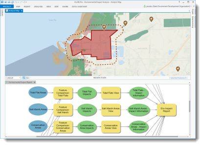

# environmental-impact-tools
Environmental Impact Tools provide analysis and reporting tools for scientists, planners, and other analysts to understand potential impact of development and other projects on the natural environment. Environmental Impact Tools leverage the core ArcGIS Platform to help organizations with analysis and reporting workflows.

## Features
This GitHub repository houses the Environmental Analysis toolset used to analyze data and report the results.  The toolset includes the following tools:
* Basic Proximity Analysis
* Distance Analysis
* Feature Comparison Analysis
* Analysis Summary
* Impact Report

## Requirements
Start using these tools now by downloading this repository as a .zip file and unzipping it to a suitable location; or clone the repository with a git tool.  Requirements for using these tools include:
* ArcGIS Pro 1.2

For more information on requirements and the use of the tools, see the [Environmental Analysis](http://links.esri.com/stategovernment/help/EnvironmentalImpactAnalysis) help.

## Resources
Learn more about Esri's [ArcGIS for State Government maps and apps](http://solutions.arcgis.com).

Show me a list of other [State Government GitHub repositories](http://esri.github.io/#State-Government).

Additional [information and sample data](http://links.esri.com/stategovernment/help/EnvironmentalImpactAnalysis)
are available for these tools.

## Issues

Find a bug or want to request a new feature?  Please let us know by submitting an issue.

## Contributing

Esri welcomes contributions from anyone and everyone.
Please see our [guidelines for contributing](https://github.com/esri/contributing).

## Licensing

Copyright 2016 Esri

Licensed under the Apache License, Version 2.0 (the "License");
you may not use this file except in compliance with the License.
You may obtain a copy of the License at

   http://www.apache.org/licenses/LICENSE-2.0

Unless required by applicable law or agreed to in writing, software
distributed under the License is distributed on an "AS IS" BASIS,
WITHOUT WARRANTIES OR CONDITIONS OF ANY KIND, either express or implied.
See the License for the specific language governing permissions and
limitations under the License.

A copy of the license is available in the repository's
[LICENSE.txt](LICENSE.txt) file.

